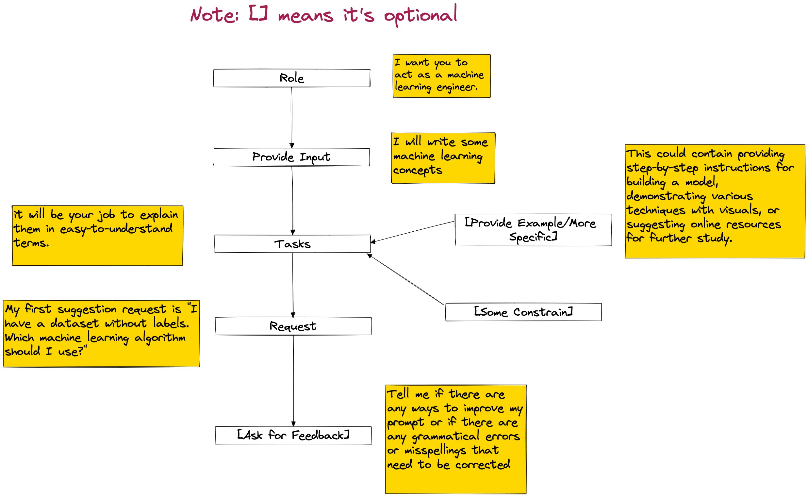

# ChatGPT Prompts Mastery

This repository is highly based on the [Awesome ChatGPT Prompts](https://github.com/f/awesome-chatgpt-prompts) repository. 

I try to use some diagrams to represent the structure of the prompts in the [Awesome ChatGPT Prompts](https://github.com/f/awesome-chatgpt-prompts). A prompt is divided into several parts: 

- the role you want ChatGPT to act
- the input you provide
- describe the task to ChatGPT
	- you can [provide examples] or [make the task more specific]
	- you can also add [some constrain].
-  I add my own understanding: improve your prompts by asking for feedback from chatGPT directly.

I believe this repository can help you use prompts flexibly and combine different prompts to fit your specific need. 

Note that the `chatgpt-prompts-structure.csv` file is just a demo; the prompts come from the `prompts.csv` file of the [Awesome ChatGPT Prompts](https://github.com/f/awesome-chatgpt-prompts) repository, hope it helps

## License

MIT
